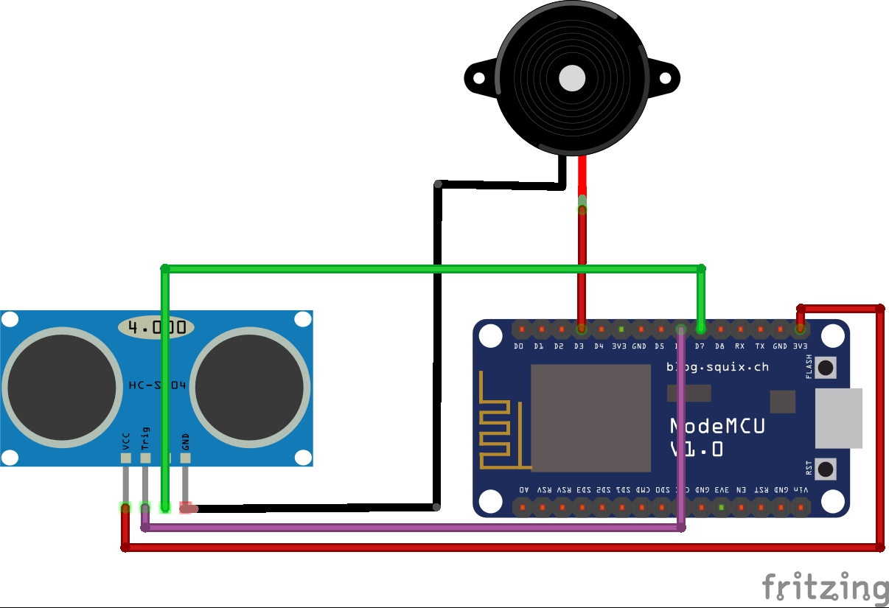

# Connect ESP8266 To Website

## Whats This

- Tutorial Connect Sensor Ultrasonik and ESP8266 To Web server use cpp, mysqli, and php

## Get in touch

- Instagram : https://instagram.com

## Scema and Code

<center></center>

// Code ESP8266 send data To webserver

```cpp
#include <ESP8266WiFi.h>
#include <ESP8266HTTPClient.h>
#include <NewPing.h>

#define BUZZER       D3
#define TRIGGER_PIN  D6  
#define ECHO_PIN     D7  
#define MAX_DISTANCE 200 

String ssid = "********"; 
String pass = "********"; 
String host = "192.168.1.5"; 

NewPing sonar(TRIGGER_PIN, ECHO_PIN, MAX_DISTANCE);

void setup() {
  Serial.begin(115200); 
  pinMode(BUZZER, OUTPUT);
  

  WiFi.hostname("NodeMCU");
  WiFi.begin(ssid, pass);

  while(WiFi.status() != WL_CONNECTED) {
    delay(500);
    Serial.println("Menunggu koneksi");  
    digitalWrite(BUZZER, HIGH);
  }

  Serial.print("IP Addr ... ");
  Serial.println(WiFi.localIP());
  digitalWrite(BUZZER, LOW);
}

void loop() {             
  Serial.print("Ping: ");
  Serial.print(sonar.ping_cm()); 
  Serial.println("cm");

  WiFiClient client;
  if(!client.connect(host, 80)) {
    Serial.println("Koneksi Gagal ...");
    return;
  } 

  String Link;
  HTTPClient http;
  Link = "http://192.168.1.5/ESP8266-To-Website/dataout.php?data=" + String(sonar.ping_cm());

  http.begin(client, Link);
  http.GET();
  http.end();   
  delay(1000);
  
}


```

// Code PHP get data from ESP8266

```php

<?php 
$koneksi = new mysqli("localhost", "root", "", "websensor");

function bulan($bulan) {
    if($bulan == "1") {
        $b = "Januari";
    }elseif ($bulan == "2") {
        $b = "Februari";
    }elseif ($bulan == "3") {
        $b = "Maret";
    }elseif ($bulan == "4") {
        $b = "April";
    }elseif ($bulan == "5") {
        $b = "Mei";
    }elseif ($bulan == "6") {
        $b = "Juni";
    }elseif ($bulan == "7") {
        $b = "Juli";
    }elseif ($bulan == "8") {
        $b = "Agustus";
    }elseif ($bulan == "9") {
        $b = "September";
    }elseif ($bulan == "10") {
        $b = "Oktober";
    }elseif ($bulan == "11") {
        $b = "November";
    }else{
        $b = "Desember";
    }

    return $b;
}

date_default_timezone_set('Asia/Jakarta');
$JM = date('H:i');
$hari = date("d");
$bulan = bulan(date("m"));
$tahun = date("Y");

$waktusekarang = $hari.' '.$bulan.' '.$tahun.' '.$JM;

$query = $koneksi->query("SELECT * FROM ultrasonik");
$ambil = $query->fetch_assoc();

$bug = '';

if (isset($_GET['data'])) {
    $id = $_GET['data'];
    if ($id < 0) {
        $bug = "maaf akses di tolak anda memasukkan parameter yang salah data tidak akan di update";
    } else if (!is_numeric($id)) {
        $bug = "maaf akses di tolak anda memasukkan parameter yang salah data tidak akan di update";
    }
    
}


if ($ambil['tanggal_us'] != $waktusekarang AND !isset($_GET['data'])) {
    $data = 'Maaf Koneksi Dengan ESP8266 Terputus';
    $cm = '';
}else{
    $cm = 'CM';
    if(mysqli_num_rows($query) > 0){
        if(isset($_GET['data'])){
            $id=$_GET['data'];
            if(is_numeric($id)) {
                $koneksi->query("UPDATE ultrasonik SET sensor_us='$id', tanggal_us='$waktusekarang'");
            }else{
                $datas = "Maaf Koneksi Sedang Tidak Aktif";
            }
        }
        
    }else{
        $koneksi->query("INSERT INTO ultrasonik(sensor_us,tanggal_us) VALUES('$id','$waktusekarang')");
    }
    $data = $ambil["sensor_us"];
}

echo $data;


?>

```

// Code HTML in website

```html

<!DOCTYPE html>
<html lang="en">
<head>
    <meta charset="UTF-8">
    <!-- <meta http-equiv="refresh" content="4" /> -->
    <meta http-equiv="X-UA-Compatible" content="IE=edge">
    <meta name="viewport" content="width=device-width, initial-scale=1.0">
    <link rel="stylesheet" type="text/css" href="css/bootstrap.min.css">
    <script type="text/javascript" src="jquery/jquery.min.js"></script>
    <title>Ultrasonik</title>
</head>
<script type="text/javascript">
    $(document).ready(function(){
        setInterval(function(){
            $("#hasildata").load('dataout.php');
        }, 1000) ;
    });
</script>
<body>
    <div class="container" style="text-align: center; padding-top: 15%; width: 500px">
        <h2>Jarak Sensor Ultrasonik</h2>
        <div class="panel panel-default">
            <div class="panel-body">
                <h1><span id="hasildata"></span> CM</h1>
            </div>
        </div>
    </div>
</body>
</html>

```


